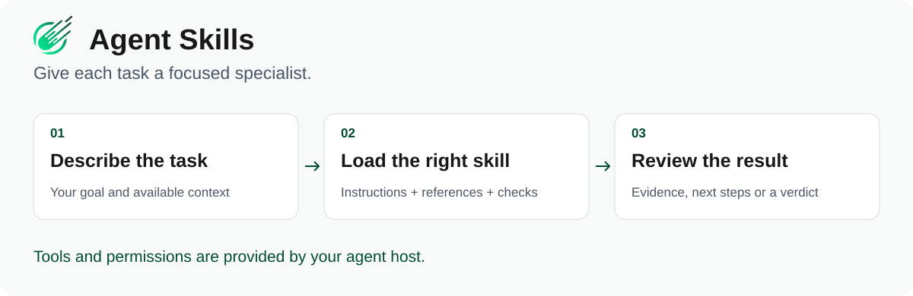

# CometWeb Agent Skills

Reusable skills that help AI coding assistants research a question, choose the next product task, audit a workflow, and review a release.



[](https://github.com/CometWeb-io/agent-skills/actions/workflows/validate.yml)
[](LICENSE)


**32 skills · Cursor, Claude Code, Codex and compatible hosts**

This repository contains 32 reusable skill packages for compatible agent hosts.

## Start here

```bash
git clone https://github.com/CometWeb-io/agent-skills.git
cd agent-skills
./scripts/install-codex.sh
```

Use `./scripts/install-claude.sh` for Claude Code or `./scripts/install-cursor.sh` for Cursor. For all supported hosts, use `./scripts/install-all.sh`. See [installation and host setup](INSTALL.md).

Then ask your assistant:

```text
Use product-operator to compare this repo with the roadmap.
Give me the three most useful next actions and how to verify each one.
```

The assistant loads the skill's instructions and uses the tools available in your host. Browser access, connectors and external actions depend on that host and your authorization.

## Pick a starting point

| You need to… | Start with | You get |
| --- | --- | --- |
| Check a claim | [evidence-researcher](skills/evidence-researcher/) | Sources, contradictions and an Evidence Pack |
| Decide what to do next | [product-operator](skills/product-operator/) | A bounded now / next / stop list |
| Inspect an app | [web-app-auditor](skills/web-app-auditor/) | Findings tied to observed behavior |
| Review a release | [release-readiness](skills/release-readiness/) | A verdict for a specific candidate |
| Combine specialists | [skill-orchestrator](skills/skill-orchestrator/) | Ordered steps and structured handoffs |

For isolated specialist runs, use [skill-orchestrator-multiagent](skills/skill-orchestrator-multiagent/).

<details>
<summary>Browse all 32 skills</summary>

## Skills

### Foundation and orchestration

| Skill | Use it for |
| --- | --- |
| [`ai-council`](skills/ai-council/) | Evidence-governed decisions, risk gates, forecasts, and GO / TEST / DEFER verdicts. |
| [`cometweb-context`](skills/cometweb-context/) | Fresh, provenance-aware context snapshots before work that depends on current project state. |
| [`evidence-researcher`](skills/evidence-researcher/) | Claim decomposition, source verification, falsifiers, contradictions, and Evidence Packs. |
| [`portfolio-operator`](skills/portfolio-operator/) | Cross-project focus, capacity conflicts, and pause / delegate decisions. |
| [`skill-orchestrator`](skills/skill-orchestrator/) | Multi-skill workflows with ordered steps and CW-AIP handoffs. |
| [`skill-orchestrator-multiagent`](skills/skill-orchestrator-multiagent/) | Isolated subagent execution for multi-skill workflows. |
| [`benchmark-curator`](skills/benchmark-curator/) | Benchmark corpora, holdouts, contamination controls, and revision hashes. |
| [`feedback-integrator`](skills/feedback-integrator/) | Recurring failure patterns, improvement proposals, and regression tests. |
| [`quality-loop-operator`](skills/quality-loop-operator/) | Briefing, review, repair, acceptance, measurement, and quality lifecycle control. |
| [`rubric-designer`](skills/rubric-designer/) | Observable evaluation criteria, evidence floors, blocker rules, and rubric locks. |
| [`skill-auditor`](skills/skill-auditor/) | Skill routing, portability, package hygiene, and supply-chain audits. |
| [`skill-evaluator`](skills/skill-evaluator/) | Fair skill experiments, behavioral lift, resource cost, and host comparisons. |

### Product, research, and partnerships

| Skill | Use it for |
| --- | --- |
| [`ai-humanize`](skills/ai-humanize/) | Natural English and Polish rewrites that preserve meaning and voice. |
| [`competitive-intelligence`](skills/competitive-intelligence/) | Competitor watchlists, change detection, and recurring delta digests. |
| [`design-partner-finder`](skills/design-partner-finder/) | Finding, qualifying, and managing design partners and early adopters. |
| [`product-operator`](skills/product-operator/) | Weekly product control loops, roadmap drift, and now / next / later / stop actions. |
| [`product-teardown`](skills/product-teardown/) | Evidence-backed product, UX, architecture, and implementation pattern analysis. |
| [`repo-to-roadmap`](skills/repo-to-roadmap/) | Whole-project baselines, gap inventories, dependencies, and target-state roadmaps. |
| [`brief-architect`](skills/brief-architect/) | Explicit artifact contracts, evidence policies, risks, and acceptance criteria. |
| [`content-writer`](skills/content-writer/) | Evidence-aware reader-facing articles, guides, reports, and documentation. |
| [`content-reviewer`](skills/content-reviewer/) | Constructive editorial QA with evidence-backed, actionable findings. |
| [`content-roaster`](skills/content-roaster/) | Adversarial content review, proof debt, objections, and repair verification. |
| [`science-roaster`](skills/science-roaster/) | Reviewer #2-style critique of methods, inference, validity, and reproducibility. |
| [`repo-roaster`](skills/repo-roaster/) | Adversarial repository review with invariants, reachability, and repair contracts. |
| [`repair-operator`](skills/repair-operator/) | Minimal dependency-aware repairs and fresh verification of closed findings. |
| [`artifact-acceptance`](skills/artifact-acceptance/) | Final evidence-backed acceptance gates for knowledge artifacts. |

### Publication, operations, QA, and release

| Skill | Use it for |
| --- | --- |
| [`customer-ops`](skills/customer-ops/) | Support triage, incidents, account risk, commitments, and engineering handoffs. |
| [`ebook-publisher`](skills/ebook-publisher/) | Research-backed ebooks, white papers, workbooks, and publication QA. |
| [`longform-publisher`](skills/longform-publisher/) | Canonical long-form manuscripts and release-ready derived documents. |
| [`release-readiness`](skills/release-readiness/) | Candidate-bound production gates and GO / GO_WITH_CONTROLS / NO_GO / DEFER verdicts. |
| [`seo-geo-aeo-maxxing`](skills/seo-geo-aeo-maxxing/) | Multi-pillar SEO / GEO / AEO visibility audits. |
| [`web-app-auditor`](skills/web-app-auditor/) | Evidence-driven click-through QA for websites and web applications. |


</details>

## What is inside a skill?

A `SKILL.md` entry point, focused references, and scripts or tests where deterministic checks help. The [registry](registry/skills.json) describes routing and compatibility; [CW-AIP](protocol/) defines handoffs between skills.

Skills supply instructions and contracts. They do not supply model subscriptions, CRM accounts, or an autonomous outbound service. A passing validator checks a contract; it does not prove that an AI answer is correct.

## OpenAI Marketplace (ChatGPT and Codex)

The repository includes a portable OpenAI plugin manifest at
[`plugin.json`](plugin.json) and a repository-scoped marketplace at
`.agents/plugins/marketplace.json`. Both point at the canonical `skills/` tree;
there is no mirrored `plugins/` skill tree to drift.

For ChatGPT workspace distribution, import
`https://github.com/CometWeb-io/agent-skills` from **Workspace settings →
Plugins → Add → Import marketplace**. Leave Path empty and leave Branch empty
to follow the default branch, or set Branch to `main`. The marketplace syncs
daily after GitHub changes; use **Sync now** when an immediate refresh is
needed. See [the full setup guide](docs/OPENAI-MARKETPLACE.md).

Codex Desktop can discover the same repository-scoped marketplace. The existing
per-host installers remain available for local skill directories and are not
replaced by the marketplace layer.

## Contribute

```bash
python3 -m pip install -r requirements-dev.txt
python3 -m pytest
python3 tooling/validate_local.py
```

See [CONTRIBUTING.md](CONTRIBUTING.md), [security reporting](SECURITY.md), and the [documentation index](docs/README.md). Maintainers can inspect [context budgets](docs/generated-context-budget.md) and [eval strength](docs/generated-eval-strength.md).

[MIT license](LICENSE) · [Changelog](CHANGELOG.md)
