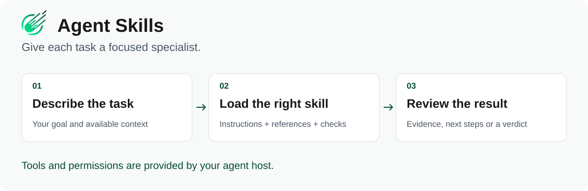

# CometWeb Agent Skills

Tested Agent Skills for research, product decisions, QA and release gates, installable in Cursor, Claude Code, Codex and other hosts that read `SKILL.md` packages.



[](https://github.com/CometWeb-io/agent-skills/actions/workflows/validate.yml)
[](LICENSE)


This repository contains 32 reusable skill packages. Each one is a `SKILL.md`
entry point plus the references, scripts and eval cases it needs, and every
package is covered by the test suite. Skills supply instructions and output
contracts. They do not supply a model, connector accounts or permission to act:
browser access, connectors and external side effects stay with your host and
your authorization.

- [Quickstart](#quickstart)
- [Pick a starting point](#pick-a-starting-point)
- [Skill catalog](#skill-catalog)
- [How skills hand off: CW-AIP](#how-skills-hand-off-cw-aip)
- [Write and evaluate a new skill](#write-and-evaluate-a-new-skill)
- [Contributing](#contributing)

## Quickstart

Clone once, then run the installer for your host. Installers **symlink** each
package from `skills/` into the host's skills directory, so keep the clone where
it is; `git pull` updates every installed skill in place.

```bash
git clone https://github.com/CometWeb-io/agent-skills.git
cd agent-skills
```

| Host | Command | Installs into | Override with |
| --- | --- | --- | --- |
| Claude Code | `./scripts/install-claude.sh` | `~/.claude/skills/` | `CLAUDE_SKILLS_DIR` |
| Cursor | `./scripts/install-cursor.sh` | `~/.cursor/skills/` and the routing rule `~/.cursor/rules/cometweb-agent-skills.mdc` | `CURSOR_SKILLS_DIR`, `CURSOR_RULES_DIR` |
| Codex | `./scripts/install-codex.sh` | `~/.codex/skills/` | `CODEX_SKILLS_DIR` |
| Qwen Code, Qoder, Lingma | `./scripts/install-qwen.sh`, `install-qoder.sh`, `install-lingma.sh` | `~/.qwen/skills/`, `~/.qoder/skills/`, `~/.lingma/skills/` | `QWEN_SKILLS_DIR`, `QODER_SKILLS_DIR`, `LINGMA_SKILLS_DIR` |
| All of the above | `./scripts/install-all.sh` | each directory above | the same variables |

A successful run ends with a line such as `OK: 32 Claude Code skills installed in /home/you/.claude/skills`.
Installers are safe to rerun. If a skill path already exists and is not one of
these links, the installer stops before changing anything; rerun with
`SKILLS_REPLACE_CONFLICTS=1` to move the conflicting entries to a dated backup
first. Every installer also accepts `--dry-run` (print the plan, write nothing)
and `--uninstall` (remove only this checkout's links).
[INSTALL.md](INSTALL.md) covers backups and the safety checks.

**Claude Code plugin.** Instead of the script, you can install the repository as
a plugin. Skills then appear namespaced, for example
`cometweb-agent-skills:evidence-researcher`.

```text
/plugin marketplace add CometWeb-io/agent-skills
/plugin install cometweb-agent-skills@cometweb-agent-skills
```

**ChatGPT and Codex marketplace.** [`plugin.json`](plugin.json) and
`.agents/plugins/marketplace.json` expose the same `skills/` tree to the OpenAI
plugin marketplace. A workspace admin imports
`https://github.com/CometWeb-io/agent-skills` under **Workspace settings →
Plugins → Add → Import marketplace**, leaving Path empty.
[docs/OPENAI-MARKETPLACE.md](docs/OPENAI-MARKETPLACE.md) has the details.

Then ask your assistant:

```text
Use product-operator to compare this repo with the roadmap.
Give me the three most useful next actions and how to verify each one.
```

## Pick a starting point

| You need to… | Start with | You get |
| --- | --- | --- |
| Check a claim | [evidence-researcher](skills/evidence-researcher/) | Sources, contradictions and an Evidence Pack |
| Decide what to do next | [product-operator](skills/product-operator/) | A bounded now / next / stop list |
| Inspect an app | [web-app-auditor](skills/web-app-auditor/) | Findings tied to observed behavior |
| Review a release | [release-readiness](skills/release-readiness/) | A verdict for a specific candidate |
| Combine specialists | [skill-orchestrator](skills/skill-orchestrator/) | Ordered steps and structured handoffs |

For isolated specialist runs, use [skill-orchestrator-multiagent](skills/skill-orchestrator-multiagent/).

## Skill catalog

<!-- BEGIN GENERATED: skill catalog (tooling/generate_adapters.py) -->
<!-- Edit registry/readme-catalog.json or registry/skills.json, then run generate_adapters.py. -->

**32 skills.** Versions come from each package's `VERSION`; the [compatibility matrix](docs/generated-compatibility-matrix.md) lists host support.

### Foundation and orchestration

| Skill | Use it for | Version |
| --- | --- | ---: |
| [`ai-council`](skills/ai-council/) | Evidence-governed decisions, risk gates, forecasts, and GO / TEST / DEFER verdicts. *(runs only when named)* | 5.2.1 |
| [`cometweb-context`](skills/cometweb-context/) | Fresh, provenance-aware context snapshots before work that depends on current project state. | 1.5.0 |
| [`evidence-researcher`](skills/evidence-researcher/) | Claim decomposition, source verification, falsifiers, contradictions, and Evidence Packs. | 1.0.4 |
| [`portfolio-operator`](skills/portfolio-operator/) | Cross-project focus, capacity conflicts, and pause / delegate decisions. | 1.2.1 |
| [`skill-orchestrator`](skills/skill-orchestrator/) | Multi-skill workflows with ordered steps and CW-AIP handoffs. | 1.1.3 |
| [`skill-orchestrator-multiagent`](skills/skill-orchestrator-multiagent/) | Isolated subagent execution for multi-skill workflows. | 1.1.3 |
| [`benchmark-curator`](skills/benchmark-curator/) | Benchmark corpora, holdouts, contamination controls, and revision hashes. | 1.7.1 |
| [`feedback-integrator`](skills/feedback-integrator/) | Recurring failure patterns, improvement proposals, and regression tests. | 1.7.1 |
| [`quality-loop-operator`](skills/quality-loop-operator/) | Briefing, review, repair, acceptance, measurement, and quality lifecycle control. | 1.7.1 |
| [`rubric-designer`](skills/rubric-designer/) | Observable evaluation criteria, evidence floors, blocker rules, and rubric locks. | 1.7.1 |
| [`skill-auditor`](skills/skill-auditor/) | Skill routing, portability, package hygiene, and supply-chain audits. | 1.7.1 |
| [`skill-evaluator`](skills/skill-evaluator/) | Fair skill experiments, behavioral lift, resource cost, and host comparisons. | 1.7.1 |

### Product, research, and partnerships

| Skill | Use it for | Version |
| --- | --- | ---: |
| [`ai-humanize`](skills/ai-humanize/) | Natural English and Polish rewrites that preserve meaning and voice. | 2.6.0 |
| [`competitive-intelligence`](skills/competitive-intelligence/) | Competitor watchlists, change detection, and recurring delta digests. | 1.1.0 |
| [`design-partner-finder`](skills/design-partner-finder/) | Finding, qualifying, and managing design partners and early adopters. | 1.2.0 |
| [`product-operator`](skills/product-operator/) | Weekly product control loops, roadmap drift, and now / next / later / stop actions. | 2.4.0 |
| [`product-teardown`](skills/product-teardown/) | Evidence-backed product, UX, architecture, and implementation pattern analysis. | 1.2.0 |
| [`repo-to-roadmap`](skills/repo-to-roadmap/) | Whole-project baselines, gap inventories, dependencies, and target-state roadmaps. | 1.1.0 |
| [`brief-architect`](skills/brief-architect/) | Explicit artifact contracts, evidence policies, risks, and acceptance criteria. | 1.7.1 |
| [`content-writer`](skills/content-writer/) | Evidence-aware reader-facing articles, guides, reports, and documentation. | 1.7.1 |
| [`content-reviewer`](skills/content-reviewer/) | Constructive editorial QA with evidence-backed, actionable findings. | 1.7.1 |
| [`content-roaster`](skills/content-roaster/) | Adversarial content review, proof debt, objections, and repair verification. | 6.1.0 |
| [`science-roaster`](skills/science-roaster/) | Reviewer #2-style critique of methods, inference, validity, and reproducibility. | 6.1.0 |
| [`repo-roaster`](skills/repo-roaster/) | Adversarial repository review with invariants, reachability, and repair contracts. | 6.1.0 |
| [`repair-operator`](skills/repair-operator/) | Minimal dependency-aware repairs and fresh verification of closed findings. | 1.7.1 |
| [`artifact-acceptance`](skills/artifact-acceptance/) | Final evidence-backed acceptance gates for knowledge artifacts. | 1.7.1 |

### Publication, operations, QA, and release

| Skill | Use it for | Version |
| --- | --- | ---: |
| [`customer-ops`](skills/customer-ops/) | Support triage, incidents, account risk, commitments, and engineering handoffs. | 2.2.0 |
| [`ebook-publisher`](skills/ebook-publisher/) | Research-backed ebooks, white papers, workbooks, and publication QA. | 1.0.2 |
| [`longform-publisher`](skills/longform-publisher/) | Canonical long-form manuscripts and release-ready derived documents. *(frozen)* | 1.1.2 |
| [`release-readiness`](skills/release-readiness/) | Candidate-bound production gates and GO / GO_WITH_CONTROLS / NO_GO / DEFER verdicts. | 1.3.0 |
| [`seo-geo-aeo-maxxing`](skills/seo-geo-aeo-maxxing/) | Multi-pillar SEO / GEO / AEO visibility audits. | 1.3.0 |
| [`web-app-auditor`](skills/web-app-auditor/) | Evidence-driven click-through QA for websites and web applications. | 1.4.0 |

<!-- END GENERATED: skill catalog -->

## What is inside a skill

```text
skills/<id>/
  SKILL.md        front door: frontmatter description (what routes it) + workflow
  VERSION         semantic version, mirrored in registry/skills.json
  references/     detail the host reads only when the skill opens it
  scripts/        deterministic kernels, validators, run_evals.py
  evals/, tests/  cases that run under pytest
  agents/         generated host adapters (do not hand-edit)
```

[`registry/skills.json`](registry/skills.json) is the source of truth for
descriptions, versions, ownership boundaries and routing signals. The Cursor
routing rule, the compatibility matrix and the catalog above are generated from
it. A passing validator checks a contract; it does not prove that an AI answer
is correct.

## How skills hand off: CW-AIP

Skills stay standalone, but when one feeds another the handoff is a typed JSON
envelope rather than prose. That is the CometWeb Agent Interchange Protocol.

```text
question ──▶ evidence-researcher ──▶ EvidenceEnvelope ──▶ ai-council ──▶ DecisionEnvelope
web-app-auditor ──▶ FindingEnvelope[] ──▶ release-readiness ──▶ release verdict
repo-to-roadmap ──▶ roadmap baseline ──▶ product-operator ──▶ handoff to a specialist
```

- **Small core, typed payload.** Every envelope carries identity, producer,
  `as_of` time, dependencies and a payload with its hash; each payload kind has
  its own JSON Schema.
- **Producer truth.** Only the emitting skill sets producer and timestamps; a
  consumer that disagrees emits a new envelope instead of editing one.
- **Status is local.** Verified for research is not verified for a decision,
  which is not verified for a release. Consumers may apply stricter gates.

[`protocol/cw-aip-v2/`](protocol/cw-aip-v2/README.md) is current;
[`protocol/cw-interchange-v1.md`](protocol/cw-interchange-v1.md) stays valid for
skills that have not migrated. [skill-orchestrator](skills/skill-orchestrator/)
runs multi-step flows and passes the envelopes between steps. Check an envelope
with:

```bash
uv run python tooling/validate_envelope.py --final fixtures/cwaip-v2/evidence-final.json
```

## Write and evaluate a new skill

You need [uv](https://docs.astral.sh/uv/) and Python 3.12+.

```bash
uv sync --group dev
uv run python tooling/new_skill.py my-skill \
  --description "80-1024 characters: what the skill does, when to use it, and when not to" \
  --summary "One line for the README catalog."
uv run python tooling/check_all.py --fast
```

The scaffold is registered and passes every fast gate straight away: a registry
entry, a README catalog row, placeholder routing cases, an eval harness that
pins a small output-contract validator, and this skill's baseline rows. All of
it is placeholder content. From there:

1. **Write the skill.** Replace the template text in `skills/my-skill/SKILL.md`
   and `references/output-contract.md`; keep `SKILL.md` short, depth goes in
   `references/`. A changed description goes into `registry/skills.json` as
   well; `validate_repo.py` compares the two.
2. **Make the evals real.** Replace `scripts/output_contract.py` and
   `evals/cases.json` with the skill's real rules, one case per rule, pinning
   the exact error list. `eval_strength.py` replaces each `if` guard in the
   modules the harness imports with `if False:`, one at a time, and fails a
   harness that still passes; rules written inside `run_evals.py` itself are
   never measured, and a harness that holds no guard fails the suite.
3. **Make routing real.** Replace the `my-skill-scaffold-*` cases in
   `evals/routing/suite.json` and the `routing_signals`, `owns` and trigger
   examples in `registry/skills.json`. Each skill needs three prompts it must
   claim and two it must not.
4. **Bump the plugin version.** A new skill changes what the plugin ships:
   raise `VERSION` (with `pyproject.toml` and the three `plugin.json` files),
   then run `uv run python tooling/plugin_release.py --record`.
5. **Regenerate and run every gate.**
   ```bash
   uv run python tooling/check_all.py --fix --fast
   uv run python tooling/check_all.py
   ```
   A grown front door or a changed eval-strength count is accepted
   deliberately; the summary prints the command that records it.

Deterministic evals prove the package keeps its contract. Whether a skill makes
a model behave better is a separate experiment; see
[docs/CONTRACT-TRACE-AND-SKILL-EVALS.md](docs/CONTRACT-TRACE-AND-SKILL-EVALS.md)
and the [skill-evaluator](skills/skill-evaluator/) skill.

## Contributing

Read [CONTRIBUTING.md](CONTRIBUTING.md) for the quality bar and the individual
checks, [SECURITY.md](SECURITY.md) for reporting a vulnerability, and the
[documentation index](docs/README.md) for everything else. Maintainers can
inspect [context budgets](docs/generated-context-budget.md) and
[eval strength](docs/generated-eval-strength.md).

[MIT license](LICENSE) · [Changelog](CHANGELOG.md)
